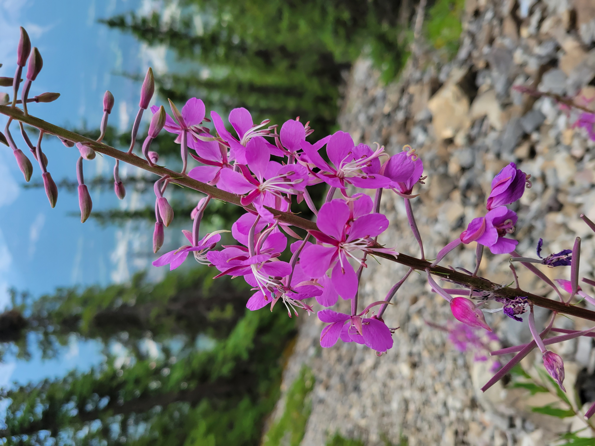
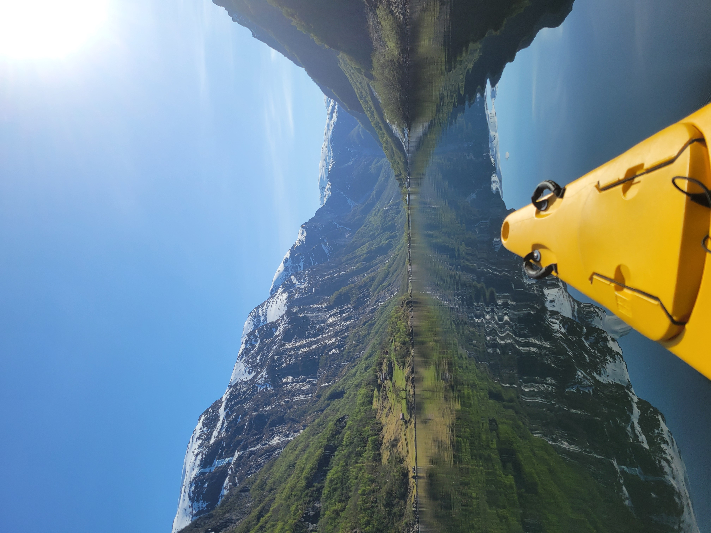
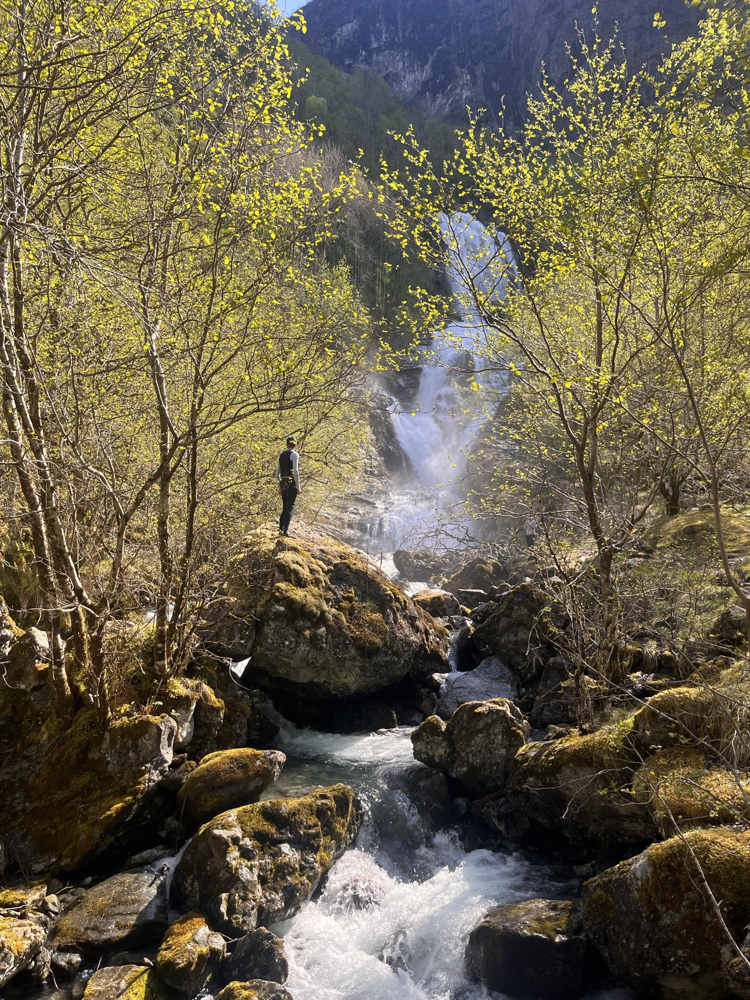
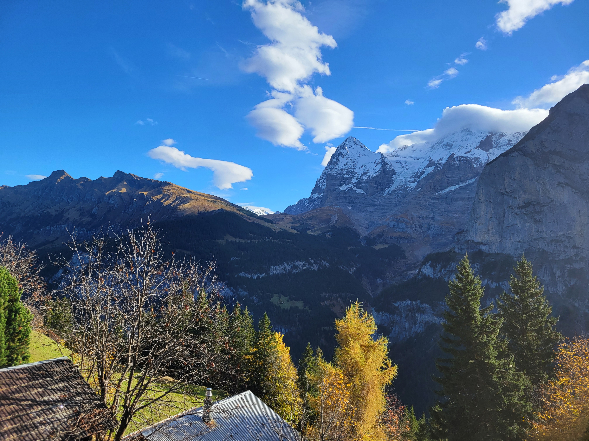
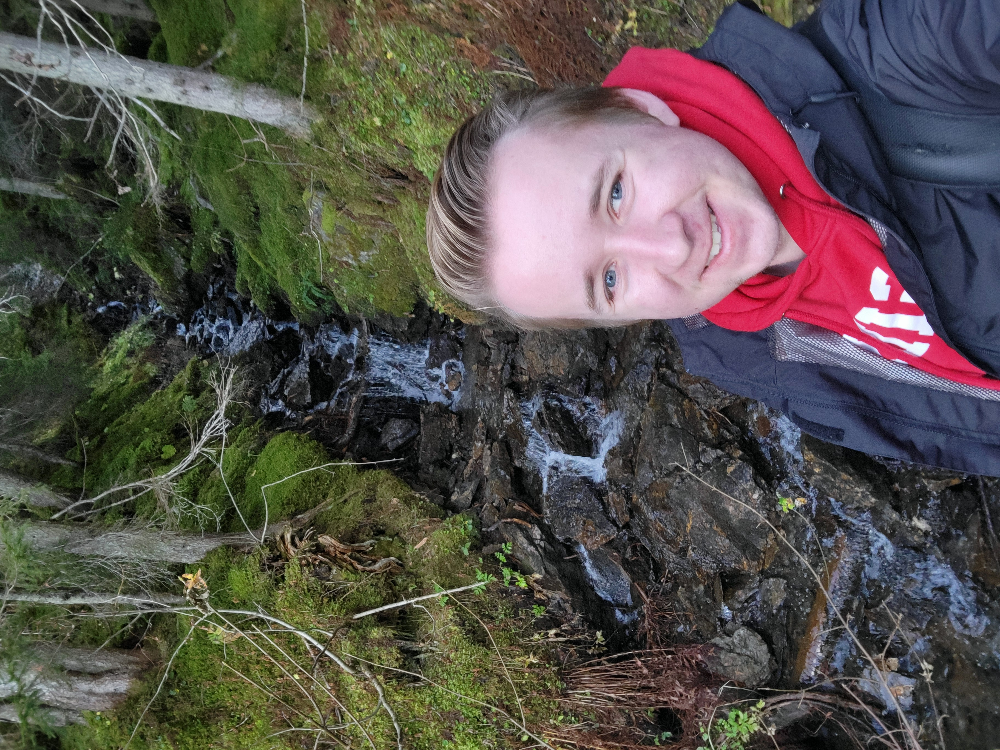

# Hiking and Nature

Being from Alberta, I had access to the rocky mountains for much of my life! In the last few years I have taken advantage of this opportunity, and typically hike in the Banff National Park and surrounding Kananaskis region. However, I also enjoy hiking every time I travel and have had some wonderful experiences in Europe!

## Banff National Park (Alberta, Canada)
I've completed many hikes West of Calgary. Here are some of my favorite pictures!

{: style="height:400px;width:auto"}
{: style="height:400px;width:auto"}
{: style="height:400px;width:auto"}
{: style="height:400px;width:auto"}
{: style="height:400px;width:auto"}
{: style="height:400px;width:auto"}

## Yoho National Park (British Columbia, Canada)
The Iceline Trail is the longest hike I have done!

{: style="height:400px;width:auto"}
{: style="height:400px;width:auto"}

## Nærøyfjord (Norway)
Breathtaking views while on a guided kayaking tour near the village of Gudvangen.

{: style="height:400px;width:auto"}
{: style="height:400px;width:auto"}
{: style="height:400px;width:auto"}

## Lauterbrunnen Valley (Switzerland)
Spectacular Fall colours in the Lauterbrunnen Valley. Even at the end of October, the grass was unbelievably green! All the animals had bells, and it sounded like a chorus of windchimes!

{: style="height:400px;width:auto"}
{: style="height:400px;width:auto"}
{: style="height:400px;width:auto"}

[About Me](../about/index.md){ .md-button }