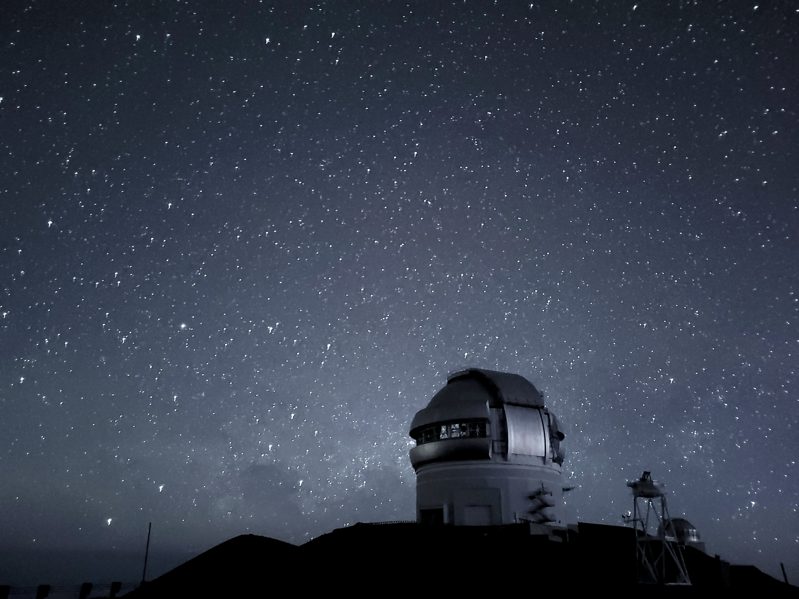

# Introduction
Motivated by my youth under the rural Canadian skies, broadly, I am passionate about the search for information in nontrivial astrophysics observations. I received my undergraduate degree in Honours Astrophysics from the University of Calgary, and am now a graduate student at McGill University. Under the direction of [Dr. Daryl Haggard](https://www.dhaggard.physics.mcgill.ca), I am keenly interested in the cross section between astrophysics and machine learning - investigating the application of diffusion models applied to James Webb Space Telescope observations of Sagittarius A*, the black hole at the center of the Milky Way.

I have a diverse array of computational research and extracurricular experience spanning a wide range of subject matters. This includes large-scale computational analysis of astrophysical data from state-of-the-art instruments including the James Webb Space Telescope, Hubble Space Telescope, and Chandra X-Ray Telescope. I also have hands-on experience with ground-based optical research telescopes at the [Rothney Astrophysical Observatory](https://science.ucalgary.ca/rothney-observatory) in Calgary, Canada.

In my time away from academia, I am an advocate for astronomy outreach and student leadership. I have participated in a variety of groups including 4H, the University of Calgary Physics and Astronomy Students Association, and was the Volunteer Coordinator at the Rothney Astrophysical Observatory for three years, enabling thousands of Calgarians to access astronomy education.

# Extracurricular Interests

- [Hiking and Nature](./hiking.md)
- [Climbing](./climbing.md)
- [Montreal Adventures](./adventures.md)

{: style="height:400px;width:auto"}
{: style="height:400px;width:auto"}
