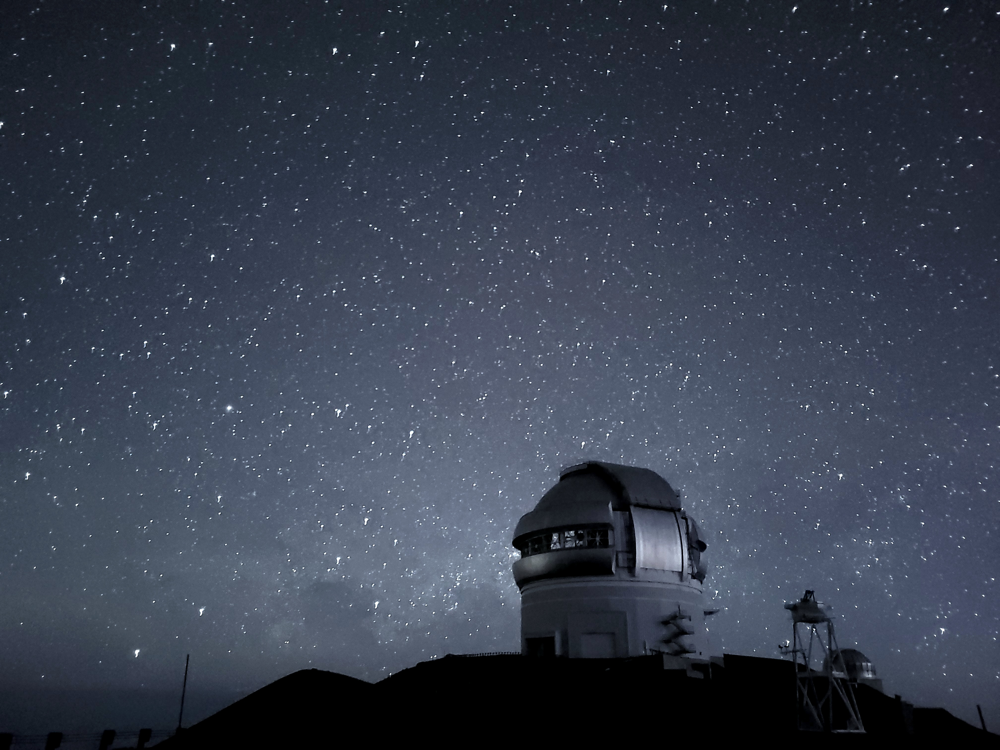

# Introduction
Motivated by my youth under the rural Canadian skies, I am passionate about learning and the search for nontrivial information in complex, real-world datasets. I received my undergraduate degree in Honours Astrophysics from the University of Calgary, and am now a graduate student at McGill University under the direction of [Dr. Daryl Haggard](https://www.dhaggard.physics.mcgill.ca). I am keenly interested in the cross section between astrophysics and machine learning, where I currently investigate the application of diffusion models for James Webb Space Telescope observations of Sagittarius A*, the black hole at the center of the Milky Way.

I have a diverse array of computational research and extracurricular experience spanning astrophysics, nuclear science, and education. This includes large-scale computational analysis of astrophysical data from state-of-the-art instruments such as the James Webb Space Telescope, Hubble Space Telescope, and Chandra X-Ray Telescope. I also have hands-on experience with ground-based optical research telescopes at the [Rothney Astrophysical Observatory](https://science.ucalgary.ca/rothney-observatory) in Calgary, Canada.

In my time away from academia, I am an advocate for astronomy outreach and student leadership. I have participated in a variety of groups including 4H, the University of Calgary Physics and Astronomy Students Association, and was the Volunteer Coordinator at the Rothney Astrophysical Observatory for three years, enabling thousands of Calgarians to access astronomy education and build scientific literacy.

# Extracurricular Interests

- [Hiking and Nature](./hiking.md)
- [Climbing](./climbing.md)
- [Montreal Adventures](./adventures.md)

{: style="height:400px;width:auto"}
{: style="height:400px;width:auto"}
