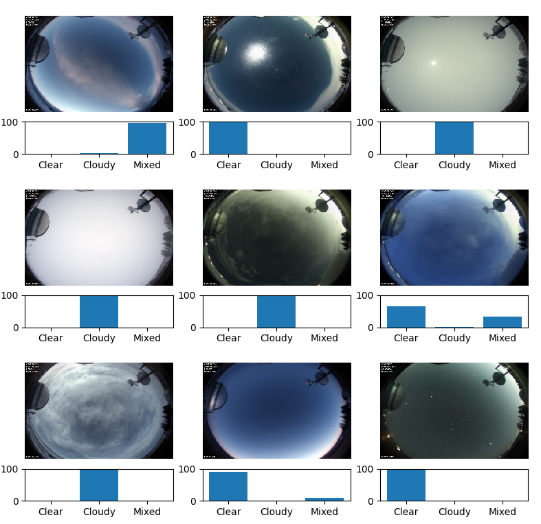

# Using Machine Learning with All Sky Camera Observations
All sky cameras are exactly what you might expect - cameras that point straight up and take pictures of the entire sky at once with the help of a fish-eye lens. Such a camera is set up at the Rothney Astrophysical Observatory (RAO). It takes a photograph once every 4 minutes (including during the day) and saves it to an archive. Over 5 years worth of images exist in the database. The camera also works in parallel with a Sky Quality Meter (SQM), a more simplistic device that simply measures the darkness of the sky straight above it. The SQM runs only at night time, and saves its readings to a database as well.

The night sky is a very dynamic place! Clouds, satellites, airglow, humidity and many others may affect the seeing quality and darkness. For the purposes of light pollution studies, it is helpful to know what the conditions of the sky were when the SQM took its readings. However, this information is not stored. To combat this problem, I created a machine learning network to classify the weather conditions of each image stored by the all sky camera, and use the classification (clear, cloudy, partly cloudy, etc) to sort the SQM readings automatically. Each all sky camera image and SQM reading is tagged with a date and time, so it is easy to cross reference them when the sky condition has been determined! This task is trivial for a human, but there are millions of images over the years. A machine learning algorithm can classify an image in a fraction of a second!

The figure below shows an example of how an early version of the algorithm classified such images!

In the end, I was successfully able to automate the determination of sky conditions above the RAO using all sky camera images, and could sort the SQM readings by weather!