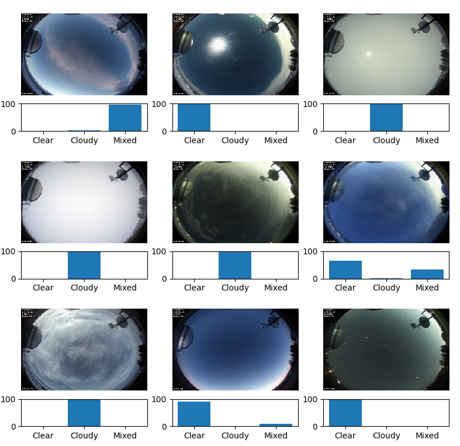

# Using Machine Learning with All Sky Camera Observations
The night sky is a very dynamic place! Clouds, airglow, humidity, precipitation, and many other factors may affect how well a telescope on the ground can capture observations of objects far out in space. Astronomers must constantly monitor how these conditions change, and make decisions of when it is safe to observe. They want to maximize the scientific and economic efficiency of the telescopes by running them as often as possible, but avoid dangerous conditions that could damage them such as precipitation.

The Rothney Astrophysical Observatory (RAO) is a research facility located southwest of Calgary, Alberta. It hosts three large telescopes, but also a number of supporting instruments that enable observers to make informed decisions. One such device is the All Sky Camera that points straight up and takes pictures of the entire sky at once using a fish eye lens. It publishes these images to a live feed, and archives them for future reference. At the RAO, the All Sky Camera takes a picture every four minutes, no matter the time of day or atmospheric conditions (it is protected from weather). It has been operating for almost 10 years, with an archive of about a million pictures!

While weather conditions are critical for astronomers, they are not easily quantifiable. Interpreting the risk of weather is therefore challenging, and subject to human bias. For instance, it may be safe to operate the telescopes in 10% cloud coverage, but not 50%. Even more challenging, how does an observer tell when it's 10% coverage?

In this work, I created a machine learning framework to classify weather conditions in all sky images to enable data-driven, quantitative atmospheric classification. Such information can empower astronomers to make risk-informed choices! I collected a significant subset of the archival photos, labeled them according to three classes (clear, partly cloudy, cloudy), then built a convolutional neural network to classify new images. The figure below shows an example of how an early version of the algorithm classified such images!

