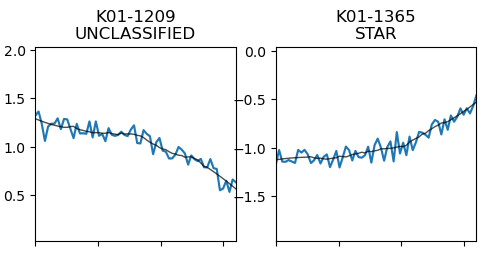

# Automated Variable Star Analysis

Differential photometry is a observational astronomy technique that I use frequently. A significant challenge in analyzing astrophysical observations is the contamination of extra light from a host of other phenomena, including but not limited to clouds, atmospheric conditions, and diffusion extended objects in the line of sight. Differential photometry solves that by using nearby sources as comparison objects, essentially allowing us to subtract out any local variation due to unknown phenomena in the image. 

The Rothney Astrophysical Observatory (RAO) has telescopes that specialize in wide field optical imaging, making the data prime candidates to catch variable stars or exoplanet transits. In this project, I created a Python pipeline to automate the detection of variable sources in widefield imaging with the help of differential photometry. The data I used as input was a series of images looking at the same patch of sky over equally spaced intervals.

With careful selection of which neighbours to use for differential photometry, we see variable behaviour with some sources in our observations. The figure below is a test case where we see inject variability into a few sources, and see if the pipeline can recognize it.

It indeed can! The pipeline can review the variability of thousands of sources over many hours of imaging!