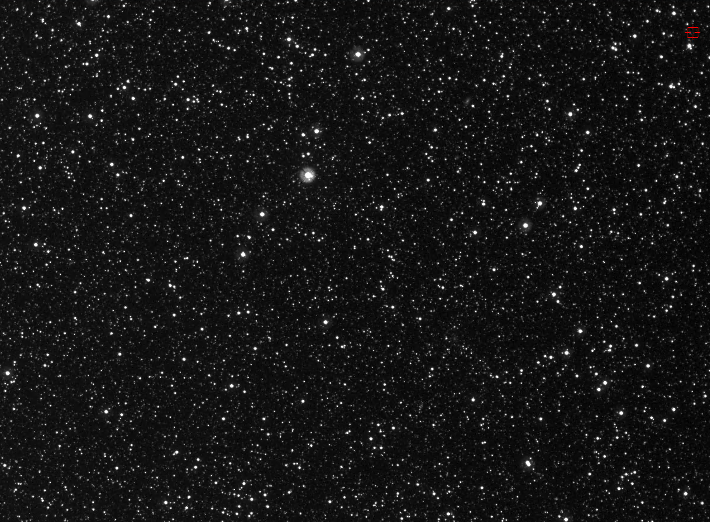

# Automated Variable Star Analysis

Differential photometry is an observational astronomy technique used to compare the brightness of one star relative to another. For example, we can quantify that star A is twice as bright as star B, even if the true brightness of both is unknown! 

A significant challenge in analyzing astrophysical observations is the contamination of light from extraneous sources such as clouds (e.g. overcast skies increase ambient brightness), light pollution, and the instrument itself. Differential photometry mitigates these issues by removing the variations that affect all sources similarly, even when their origin is unknown. In the case of stars A and B, if both are captured under identical conditions, background effects may brighten the entire image, but the relative brightness between two sources remains unchanged (A is still twice as bright as B).

The Rothney Astrophysical Observatory (RAO), located southwest of Calgary, Alberta, operates telescopes designed for wide field optical imaging (they see more of the sky at once). This makes them well-suited for studying variable stars and exoplanet transits because multiple sources can be monitored within a single image. However, the analysis to detect these objects is difficult to perform manually, and impractical at scale. In this project, I created a Python pipeline to automate the detection of variable sources in wide field imaging using differential photometry techniques.

We collected time-series images of the sky over a number of nights (one snapshot is shown above). To find the variable stars, I first reduced the data to a research-grade level using standard image processing techniques (for example, removing noise), then applied existing Python astronomy packages to extract the positions and brightness of every star in the field. I compared each star to a set of neighbouring reference stars across the time-series, then developed a flagging algorithm to identify anomalous sources whose brightness varied relative to their neighbours over the observing window. The figure below shows the results of a test case where I artificially injected variability into a few sources.

The blue line shows that the brightness of two sources decreases and increases over the time-series, indicating clear variability! The pipeline correctly identified these objects among thousands of non-variable stars. 

After validation, we applied the pipeline to hundreds of observations, containing millions of stars, classifying real sources according to their variable behaviour. Automated pipelines such as this enable efficient, scalable data analysis, particularly in the era of big data and large astronomical datasets.
