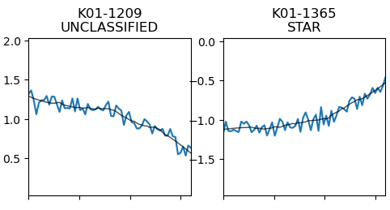

# Automated Variable Star Analysis

Differential photometry is a observational astronomy technique to understand how the brightness of one star compares to another. For example, we can quantify that star A is twice as bright as star B, even if we don't know the true brightness of either! 

A significant challenge in analyzing astrophysical observations is the contamination of light from other sources such as clouds (notice that it's slightly brighter at night when it's overcast), light pollution, and the instrument itself. Differential photometry is useful in these cases because it subtracts out any of this local variation (even if we don't know the cause of it). In the case of star A and star B, if both of them are captured by the same telescope at the same location, light pollution might make the entire observation slightly brighter, but A is still twice as bright as B!

The Rothney Astrophysical Observatory (RAO), southwest of Calgary, Alberta, operates telescopes that specialize in wide field optical imaging (they see more of the sky at once). This makes them useful for observing variable stars or exoplanet transits because we can see more of them in the same image. In this project, I created a Python pipeline to automate the detection of variable sources in wide field imaging using differential photometry techniques. 

We collected time-series images of the sky

With careful selection of which neighbours to use for differential photometry, we see variable behaviour with some sources in our observations. The figure below is a test case where we see inject variability into a few sources, and see if the pipeline can recognize it.

It indeed can! The pipeline can review the variability of thousands of sources over many hours of imaging!
