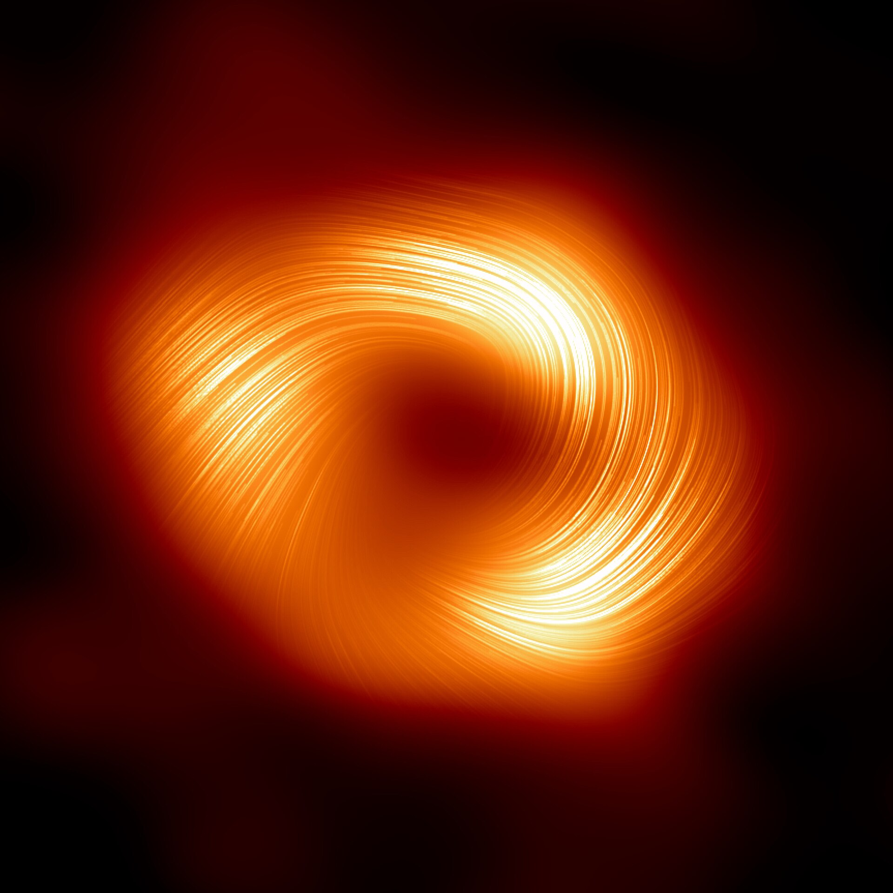
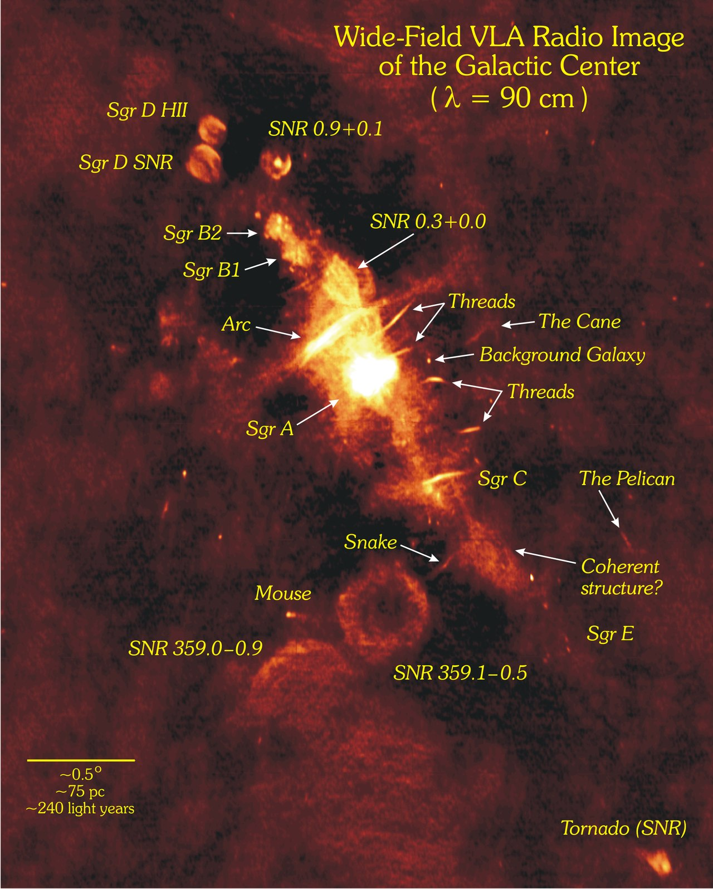

# Research

With recent advances in telescope hardware, astrophysical data is being collected at an unprecedented rate. As such, advanced automated or semi-automated methods are required to process such observations. My interest is in this cross section between computational methods such as machine learning and astrophysics.

Sagittarius A\* (Sgr A\*) at the center of the Milky Way is 100 times closer than the next nearest  supermassive  black  hole.  It  has  long  been  an  object  of  observational  interest  due  to  its comparatively weak accretion, variability in the form of flaring, and relative proximity which make it a perfect laboratory to study accretion theory and test general relativity [1]. 

{: style="height:500px;width:auto"}

https://en.wikipedia.org/wiki/Sagittarius_A*

{: style="height:500px;width:auto"}

https://en.wikipedia.org/wiki/Sagittarius_A

It has been observed for over two decades in  a variety of  electromagnetic regimes in the radio, sub-millimeter, near-infrared, far-infrared, and X-ray regions [2]. This has allowed the characterization of its spectral energy distribution (SED), a large-scale illustration of its flux as a function of wavelength. Such a distribution has generated classes of models to describe its emission and variability, improving our understanding of black hole growth, activate galactic nuclei, and extreme accretion physics [3, 4]. However, there still exist open questions about the underlying physics that drive its behavior and subsequent response at different wavelengths, so an accurate description of Sgr A*’s light profile is important [2]. Furthermore, the density of the galactic center make observations very difficult. Take the figure below of radio observations in the galactic center as an example.

**In this project, I employ contemporary machine learning techniques that characterize and remove noise to extract precise flux information and improve our understanding of Sgr A*’s light profile in the previously unmeasured mid-infrared region with the James Webb Space Telescope.**

## Relevant Publications

[1] [R. Schödel et al., “The mean infrared emission of Sagittarius A*”](https://www.aanda.org/articles/aa/full_html/2011/08/aa16994-11/aa16994-11.html)

[2] [S. D. Von Fellenberg et al., “A Detection of Sgr A* in the Far Infrared”](https://iopscience.iop.org/article/10.3847/1538-4357/aacd4b)

[3] [R. Genzel, F. Eisenhauer, and S. Gillessen, “The Galactic Center massive black hole and nuclear star cluster”](https://journals.aps.org/rmp/abstract/10.1103/RevModPhys.82.3121)

[4] [K. Dodds-Eden et al., “Evidence for X-ray Synchrotron Emission from Simultaneous Mid-Infrared to X-ray Observations of a Strong Sgr A* Flare”](https://iopscience.iop.org/article/10.1088/0004-637X/698/1/676)

