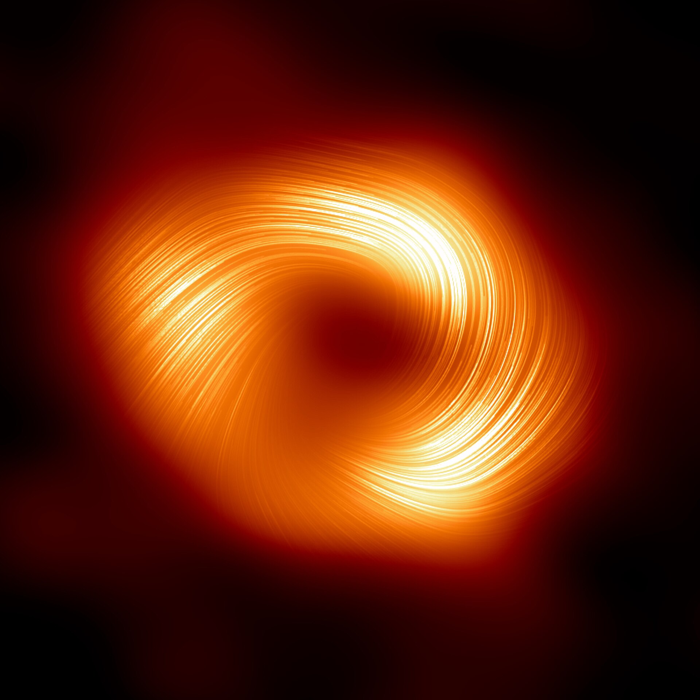
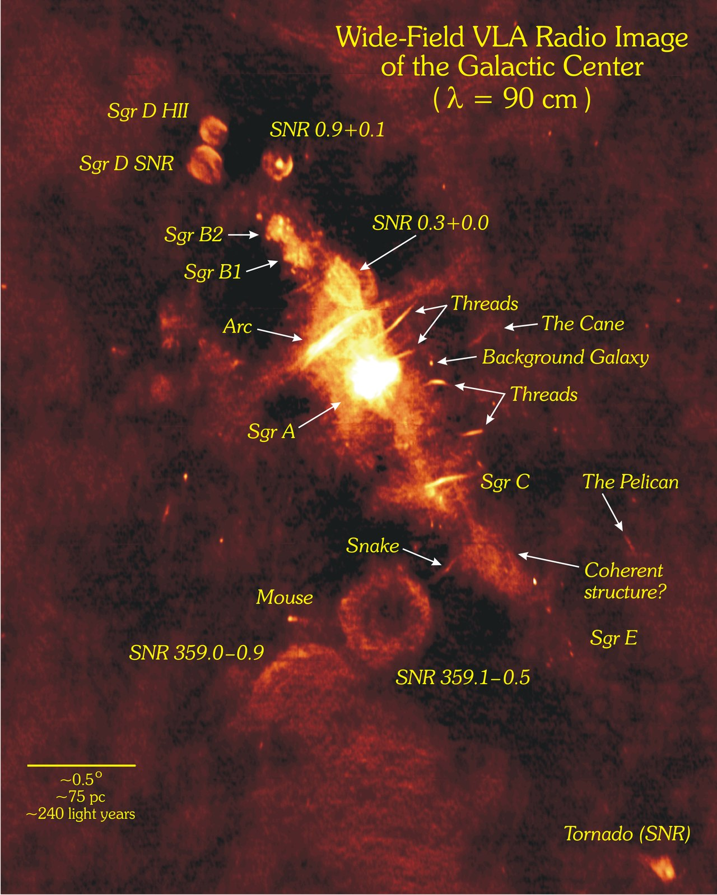

# Research

Astrophysics has entered the era of big data. Flagship observatories such as the James Webb Space Telescope (JWST) have transformed the volume, sensitivity, and resolution of modern astrophysical datasets. As a result, advanced automated or semi-automated methods are now necessary to process, understand, and analyze such observations. I am interested in developing computational methods with emerging technologies such as machine learning to increase the efficiency and richness of insights from these datasets to understand how systems work.

Sagittarius A\* (Sgr A\*), the supermassive black hole at the center of the Milky Way is 100 times closer than the next nearest and is an object of observational interest because of its comparatively weak accretion and variability. This makes it an excellent laboratory to study accretion theory and test general relativity [1]. 

{: style="height:500px;width:auto"}

{: style="height:500px;width:auto"}

However, Sgr A* lies at the heart of the densely populated and structurally complex Galactic Center, containing dust that obscures its emission. This attenuation weakens signal and limits the accuracy of models describing its behaviour. These effects must be corrected to fully characterize the processes near the black hole. The figure below shows an example of the complexity of the Galactic Center in the radio as an example.

**In my Master's thesis, I employ contemporary machine learning techniques to deblend Galactic Center images into distinct structural components, isolating Sgr A* from the rest of the gaseous medium to extract precise flux information and improve our understanding of Sgr A*.**

I recently completed my thesis related to this work, with a peer-reviewed publication detailing the results in preparation.

## Relevant Publications

[1] [R. Schödel et al., “The mean infrared emission of Sagittarius A*”](https://www.aanda.org/articles/aa/full_html/2011/08/aa16994-11/aa16994-11.html)

[2] [S. D. Von Fellenberg et al., “A Detection of Sgr A* in the Far Infrared”](https://iopscience.iop.org/article/10.3847/1538-4357/aacd4b)

[3] [R. Genzel, F. Eisenhauer, and S. Gillessen, “The Galactic Center massive black hole and nuclear star cluster”](https://journals.aps.org/rmp/abstract/10.1103/RevModPhys.82.3121)

[4] [K. Dodds-Eden et al., “Evidence for X-ray Synchrotron Emission from Simultaneous Mid-Infrared to X-ray Observations of a Strong Sgr A* Flare”](https://iopscience.iop.org/article/10.1088/0004-637X/698/1/676)

